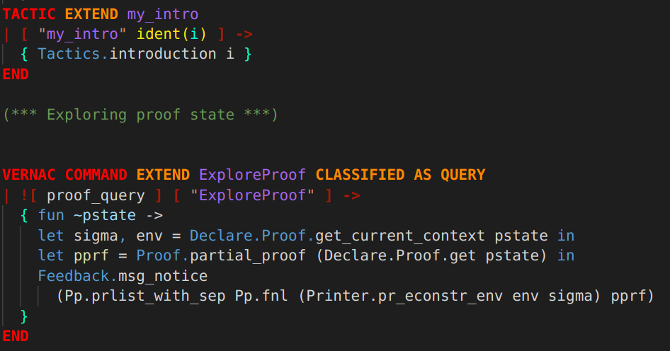

# mymlg
A simple vscode extension for syntax highlighting coq extension files(.mlg)

$$\frac{1}{2}$$
<hr/>

## Sample

<hr/>

## Installation 
1.  Download these under the extensions folder of vscode. (
  **~/.vscode/extensions** in linux)

2. Add the following lines at the end of your settings.json file. (Search "**Editor:Token Color Customizations**" in the settings menu)
```
"editor.tokenColorCustomizations": {
  "textMateRules": [
    {
        "scope": "mlg.ocaml",
        "settings": {
            "foreground": "#07ffde"
        }
    },
    {
        "scope": "mlg.keyword",
        "settings": {
            "foreground": "#ff8800"
            ,"fontStyle": "bold"
        }
    },
    {
      "scope": "mlg.keyword.block",
      "settings": {
          "foreground": "#ff0000"
          ,"fontStyle": "bold"
      }
    },
    {
      "scope": "mlg.name",
      "settings": {
          "foreground": "#a666f0"
      }
    },
    {
      "scope": "mlg.symbol",
      "settings": {
          "foreground": "#a51a07",
          "fontStyle": "bold"
      }
    },
    {
      "scope": "mlg.typing",
      "settings": {
        "foreground": "#f8e80e"
      }
    }
  ]
}
```

3. You may have to re-launch vscode to see the syntax highlighting in action. Try out the examples from the coq plugin tutorials [0](http:github.com/coq/coq/tree/master/doc/plugin_tutorial/tuto0/src/g_tuto0.mlg), [1](http:github.com/coq/coq/tree/master/doc/plugin_tutorial/tuto1/src/g_tuto1.mlg), [2](http:github.com/coq/coq/tree/master/doc/plugin_tutorial/tuto2/src/g_tuto2.mlg) and [3](http:github.com/coq/coq/tree/master/doc/plugin_tutorial/tuto3/src/g_tuto3.mlg) and adjust the font settings in the settings.json color customization entries as you need.