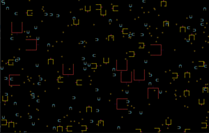
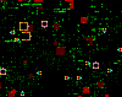
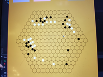

### Projects For Fun

#### pixelworld 

A virtual ecosystem that (is meant to) includes animals, plants, intelligence, and evolution. ([pixelworld](https://github.com/daeseoklee/pixelworld))
A technical specification of the ecosystem (in Korean) can be found [here](https://github.com/daeseoklee/pixelworld/blob/master/_docs/pixelworld.pdf). The prototype was developed in golang. Unfortunately, the intelligence part didn't seem to work as intended. 

##### Todo
* Nothing yet.

#### miniworld
A simplified and modified version of *pixelworld*, written in Python and Cython([miniworld](https://github.com/daeseoklee/miniworld)). [Here](https://github.com/daeseoklee/miniworld/blob/master/docs/draft.pdf)'s an experiment-based quasi-scientific argument that the intelligence part *did* work as intended. 

##### Todo
* I see the article is not well-written, so I'm willing to edit it if anyone wants clarification.

#### hexago 

Go played on a hexagonal board.([hexago](https://github.com/daeseoklee/hexago)).

##### Todo 
* Develop an easy interface to quickly generate the go game with a custom board(an arbitrary simple planar graph)
* Create a website where people can play this game.

