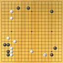

### Hobbies 

#### The game of Go 

Go is probably the best board game you could ever think of, not that I know much about other board games. This is what I like about it: 
* At every point of play, it requires you to think in many ways: extensive local *readings*, value judgement on both local and global level, strategic design of the future story of the play, and last but not least, some lowkey psychological warfare. 
* Lots of *degrees of freedom*. 
* Each game has its own dramatic story. 
* Lots of discussions about which *shapes* are the best are still going on, accelerated by the recent development of super-pro-level AI systems.  

I learned Go for about three years when I was very young, and it later became a hobby. Nowadays, I seldom play, but sometimes watch Youtube lectures on it. 

#### Podcasts

Here are some podcasts I enjoy: 
* *The Skeptics Guide to the Universe*
* *Freakonomics Radio*
* *The 80,000 Hours Podcast* 

### Learning material recommendations 

This is a list of learning materials that I felt were particularly impressive in either the insights they offer or the clarity of their presentation.  

#### Mathematics 
*  ***Additive Combinatorics*** by Terence Tao and Van Vu

All different approaches of additive combinatorics with deliberate efforts to make connections between them. Many instructive exercise problems. You can learn many other disciplines of mathematics along the way.  
* Professor Sangil Oum's video lecture series on graph theory. 

A comprehensive overview of basic (structural) graph theory, with extra topics like well-quasi-order and matroid theory. 

#### Computer Science  

* ***Causality*** by Judea Pearl

Before reading this, the concept of *causal relation* always confused me. I just didn't know how to make sense of it, besides things like "change one variable at a time and observe the effect". This book teaches you how to construct a model about (a fragment of) the world which is not only statistical but also *causal*, and related theoretical and practical issues.  

#### Programming
* ***Windows System Programming*** by Seong-woo Yoon

I learned the basics of computer systems from this book. Very good as a quick introduction for those who know nothing about computer systems. 

